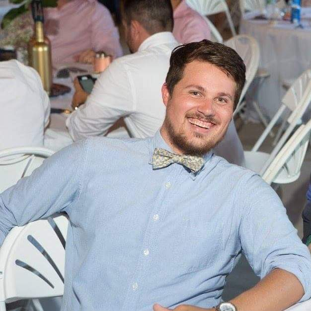

## **Code Fellows**

My name is Chase McFaddin. I was born and raised in small town Kingstree, South Carolina. I went to college in Myrtle Beach where I graduated with a Bachelor of Science in Recreation & Sport Management. I've had numerous jobs from bartending, pest control, jet-ski tours, and being an interpretitive park ranger. I currently work in sales for a retailer of Verizon-Cellular Sales. I'm looking to start a new path with Code Fellows. One which will hopefully be as rewarding as it is challenging. My hobbies include fantasy sports, video games, hiking and kayaking, watching lots of television and listening to podcasts.

Let's connect:

- [Linkedin](https://www.linkedin.com/in/chase-mcfaddin-62a8a548/)

### **Table of Contents:**
 
- [Code 102](102/README.md)
- [Code 201](201/README.md)
- [Code 301](301/README.md)
- [Code 401](401/README.md)

Check out more 0f my work I've developed at Code Fellows:

- [My GitHub page](https://github.com/ChaseMcFaddin)